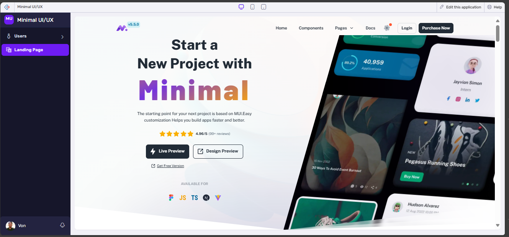
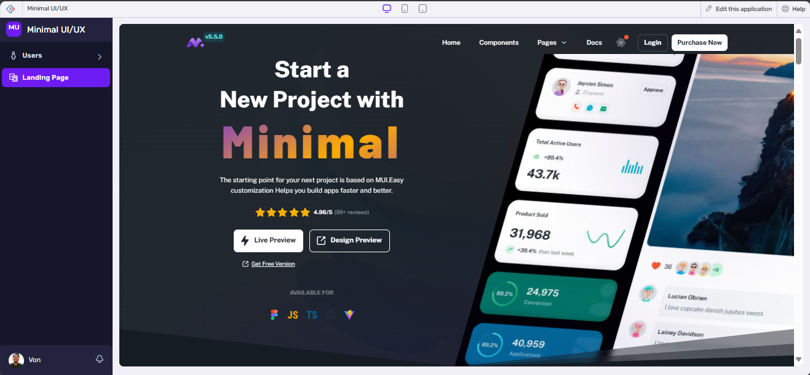

# Homepage

## Zoho Creator Widget

## Change /frontend/package.json

- development : "homepage":"/app"
- production : "homepage": see creator link
- Dont forget to change config-global and packagejson -https://f58640bc-3647-46f9-a09f-fc986c678109.zappsusercontent.com/appfiles/v2/f58640bc-3647-46f9-a09f-fc986c678109/1.0/4dd9cde3b7df9cec88970e5ffd21ff718a197d35d360ae0d1001d0fb08f01cbc/r6/app

Last - https://f58640bc-3647-46f9-a09f-fc986c678109.zappsusercontent.com/appfiles/v2/f58640bc-3647-46f9-a09f-fc986c678109/1.0/4dd9cde3b7df9cec88970e5ffd21ff718a197d35d360ae0d1001d0fb08f01cbc/r10/app

last OSI- https://f58640bc-3647-46f9-a09f-fc986c678109.zappsusercontent.com/appfiles/v2/f58640bc-3647-46f9-a09f-fc986c678109/1.0/4dd9cde3b7df9cec88970e5ffd21ff718a197d35d360ae0d1001d0fb08f01cbc/r16/app

https://f58640bc-3647-46f9-a09f-fc986c678109.zappsusercontent.com/appfiles/v2/f58640bc-3647-46f9-a09f-fc986c678109/1.0/4dd9cde3b7df9cec88970e5ffd21ff718a197d35d360ae0d1001d0fb08f01cbc/r18/app/index.html
